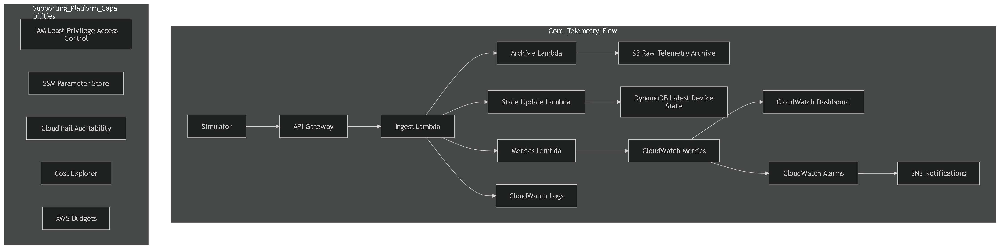

# Architecture Overview

## Overview

AWS CPEmon Lite is a lightweight AWS-native telemetry monitoring MVP inspired by a cloud-based CPE monitoring scenario.

The goal of this project is to simulate a simple but realistic telemetry path from devices into AWS while keeping the design minimal, cost-aware, and easy to explain in interviews. The architecture favors managed AWS services to reduce operational overhead and avoid unnecessary platform complexity.

## Architecture Diagram

## Architecture Description

The architecture is centered around a lightweight AWS-native telemetry pipeline.

A simulator sends telemetry payloads to API Gateway over HTTPS. API Gateway forwards requests to the ingestion Lambda, which acts as the main entry point for telemetry processing.

The ingestion Lambda performs the following responsibilities directly:

* validates telemetry payloads
* derives a lightweight health state
* stores raw telemetry in S3
* stores structured telemetry records in DynamoDB
* publishes CloudWatch custom metrics
* writes processing logs to CloudWatch Logs

In addition to the ingestion path, the architecture includes a scheduled heartbeat-check Lambda. This Lambda is triggered by an EventBridge schedule every 10 minutes, scans the DynamoDB telemetry history table, derives the most recent `last_seen` value per device, counts stale devices, and publishes the fleet-level metric `FleetMissingHeartbeatCount`.

CloudWatch Metrics feeds both CloudWatch Dashboard and CloudWatch Alarms. The dashboard provides a lightweight operational view of fleet-level signals and supporting device-level signals. CloudWatch Alarms trigger SNS notifications when abnormal conditions are detected. The dashboard also supports lightweight per-device drill-down through a `deviceId` variable for supporting investigation views.

In addition to the core telemetry path, the platform also includes supporting platform capabilities such as IAM, Systems Manager Parameter Store, CloudTrail, Cost Explorer, and AWS Budgets. These components are not part of the direct telemetry path, but they support access control, configuration handling, auditability, and cost visibility.

For the current MVP, CloudTrail is used through the default Event history view to provide lightweight control-plane auditability awareness rather than a dedicated long-term audit trail.

The architecture is intentionally minimal and interview-friendly. It demonstrates ingestion, event-driven processing, storage split by access pattern, observability, alerting, lightweight security thinking, and cost-aware cloud design without expanding into a full production-scale platform.

## Core Telemetry Flow

The main telemetry path is:

**Simulator → API Gateway → Ingest Lambda**

The processing path then continues as:

* **Ingest Lambda → S3 Raw Telemetry Archive**
* **Ingest Lambda → DynamoDB Telemetry History**
* **Ingest Lambda → CloudWatch Metrics**
* **Ingest Lambda → CloudWatch Logs**
* **EventBridge schedule → Scheduled heartbeat-check Lambda**
* **Scheduled heartbeat-check Lambda → CloudWatch Metrics**

The observability and alerting path is:

**CloudWatch Metrics → CloudWatch Dashboard**
**CloudWatch Metrics → CloudWatch Alarms → SNS Notifications**

The primary fleet-level operational signals are:

* `FleetWanDownCount`
* `FleetMissingHeartbeatCount`

## Supporting Platform Capabilities

The architecture also includes a lightweight set of supporting platform capabilities:

* IAM least-privilege access control
* Systems Manager Parameter Store
* CloudTrail auditability
* Cost Explorer
* AWS Budgets

These are intentionally shown as supporting capabilities rather than part of the main telemetry flow, in order to keep the architecture clear and easy to explain.

## Why the Architecture Is Split This Way

The diagram separates the platform into two layers:

1. **Core Telemetry Flow**
   This contains the direct business path for ingestion, processing, storage, observability, and alerting.

2. **Supporting Platform Capabilities**
   This contains cross-cutting concerns such as security, auditability, configuration handling, and cost visibility.

This separation makes the architecture much easier to understand than mixing all capabilities into a single dense diagram.

